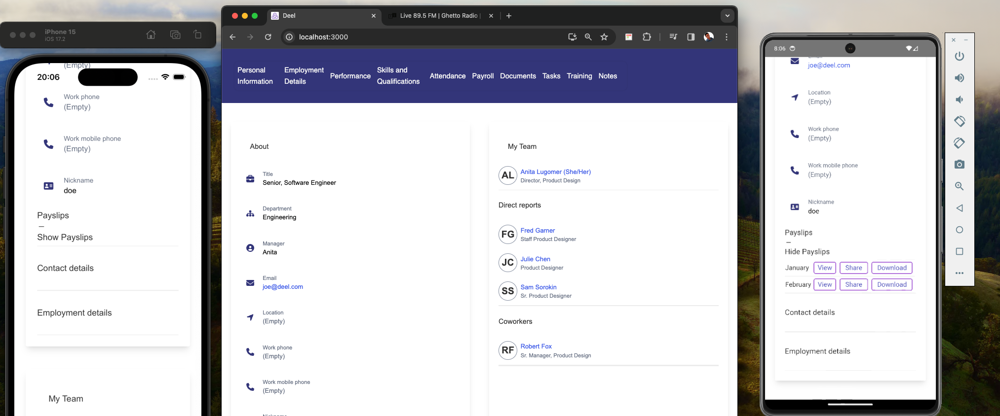
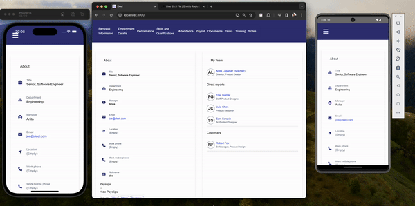

# Payslip Management Application

This is a cross-platform application built with React and Capacitor. It allows users to view, download, and share payslips. Each payslip is associated with a specific month and year, and is stored as a PDF file.

## Table of Contents

- [Prerequisites](#prerequisites)
- [Installation](#installation)
- [Adding Capacitor](#adding-capacitor)
- [Running the App](#running-the-app)
- [Project Structure](#project-structure)
- [Contributing](#contributing)
- [License](#license)

## Prerequisites

Before you begin, ensure you have met the following requirements:

- You have installed Node.js.
- You have a package manager like npm or yarn.
- You have Xcode installed for iOS development.
- You have Android Studio installed for Android development.

## Installation

Follow these steps to get your development environment set up:

1. Clone the repository:
`git clone https://github.com/username/project.git `.

2. Navigate to the project directory: 
`cd project`.

3. Install the dependencies:
`npm install`.

## Adding Capacitor
Capacitor is used for cross-platform capabilities. Follow these steps to add Capacitor to your project:

- Install Capacitor:
`npm install @capacitor/core @capacitor/cli`. 

- Initialize Capacitor:
`npx cap init` 
-  Add the platforms you want to target:
`npx cap add ios npx cap add android`.
- 
## Running the App

Follow these steps to run the app:

1. Start the development server:
`npm start` 
2. Open a new terminal and build the app for the desired platform:

For iOS:
`npx cap copy ios npx cap open ios`. 
- Then, run the app from Xcode.

For Android:
`npx cap copy android npx cap open android`


Then, run the app from Android Studio.

## Project Structure
```
project/
├── node_modules/
├── public/
│   ├── index.html
│   └── ...
├── src/
│   ├── components/
│   │   ├── PayslipList.tsx
│   │   ├── PayslipItem.tsx
│   │   └── ...
│   ├── interfaces/
│   │   ├── Payslip.ts
│   │   └── ...
│   ├── App.tsx
│   ├── index.tsx
│   └── ...
├── ios/
│   ├── App/
│   │   ├── App/
│   │   ├── public/
│   │   └── ...
│   └── Pods/
├── android/
│   ├── app/
│   │   ├── src/
│   │   └── ...
│   └── gradle/
├── .gitignore
├── package.json
├── tsconfig.json
└── README.md 
```

### Screens 



### Video Recording 




Thank you 